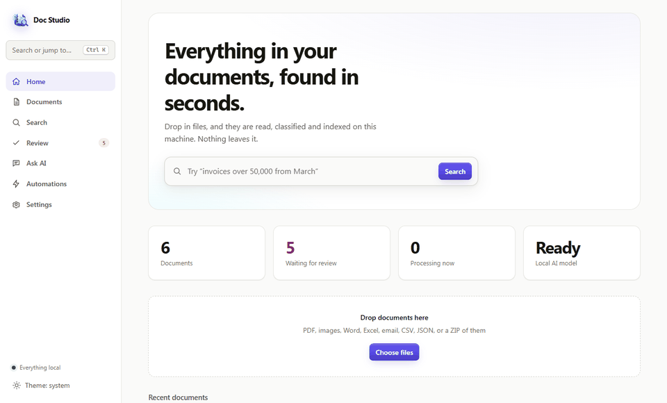
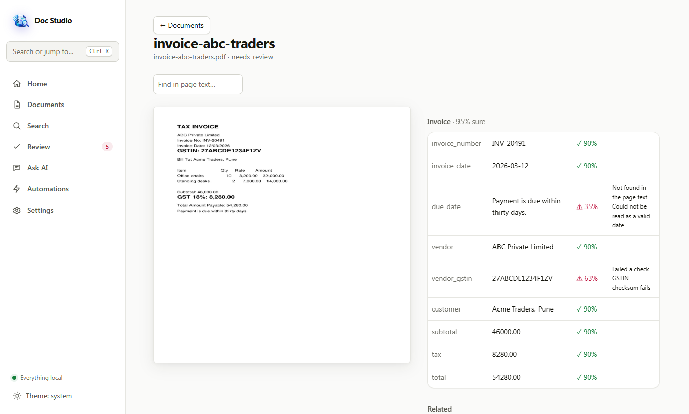
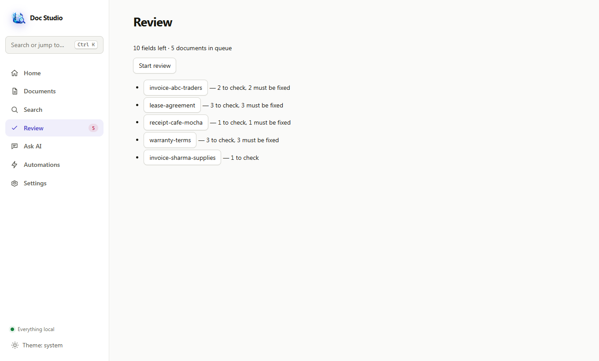
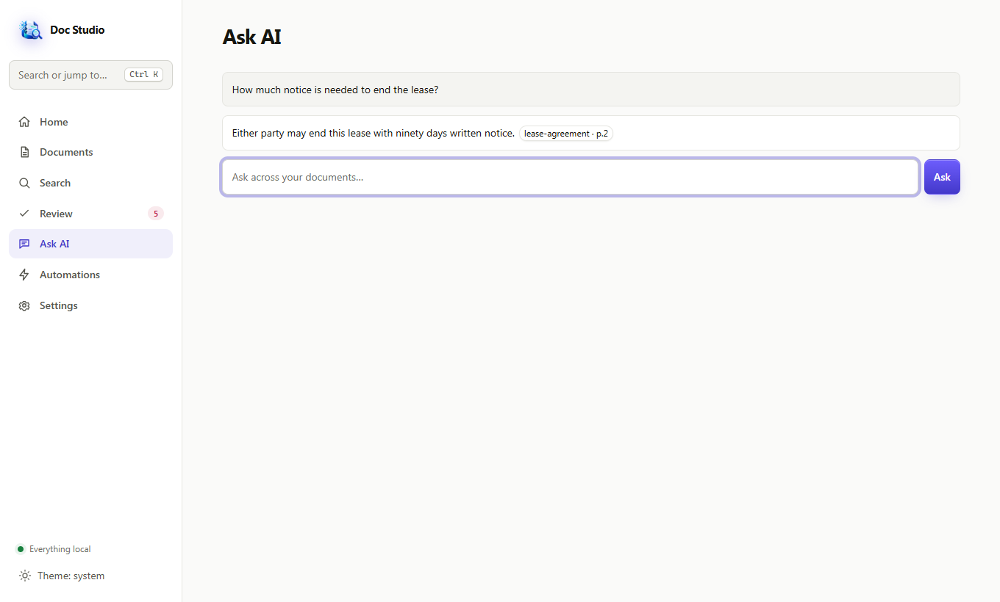
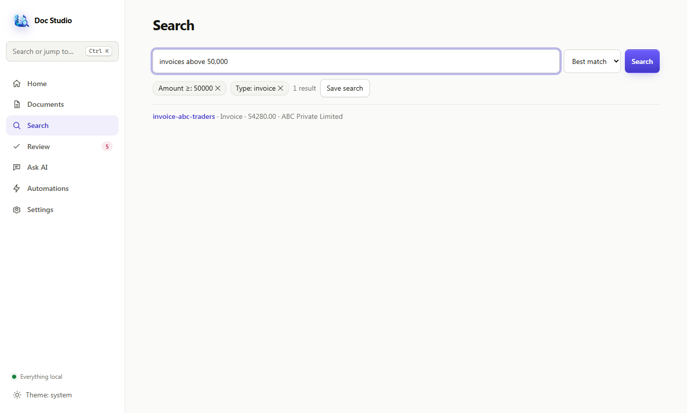
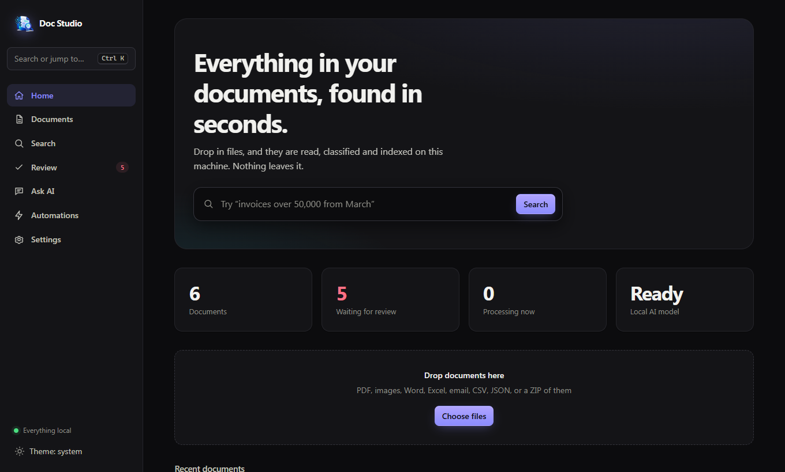

<p align="center"></p>

<h1 align="center">AI Document Intelligence Studio</h1>

<p align="center"><b>Private, local AI for your documents.</b><br>OCR, evidence-backed field extraction, hybrid search and cited answers. Everything runs on your machine, and nothing is uploaded.</p>

<p align="center">
  <a href="LICENSE"></a>
  
  
  
  
  
  
</p>

<p align="center"></p>

Drop in invoices, contracts, scans, spreadsheets or emails. The app reads them, works out what they are, pulls out the important fields **with the exact spot on the page as evidence**, makes everything searchable, and answers questions with page-level citations. It runs as one process with one data folder. Models run through [Ollama](https://ollama.com).

> Python (FastAPI) · SQLite (FTS5 + sqlite-vec) · React + TypeScript · Ollama · no cloud, no telemetry

## Why this exists

Most "chat with your PDFs" tools upload your files to someone else's server and give you answers you can't check. This one is built for documents that can't leave the building (client invoices, contracts, medical or financial records) and for results you can verify:

- **Nothing leaves your machine.** Loopback-only server, no telemetry, no CDN assets.
- **Every value has evidence.** Extracted fields link to the box on the page, with a confidence score and the reason when something looks wrong.
- **The model can't make things up silently.** Values are grounded against the OCR text, validated (checksums, dates, totals), and low-confidence ones go to a review queue.
- **Answers cite their source,** and say "not found" when your documents don't contain the answer.

## Screenshots

| | |
|---|---|
|  |  |
| **Home:** search, stats, drag-and-drop import | **Document:** page on the left, fields with confidence and validation on the right |
|  |  |
| **Review queue:** only what needs a human | **Ask AI:** cited answers from your documents |
|  |  |
| **Search:** plain-English filters become chips | **Dark mode** (follows your system) |

Screenshots are generated from a real running app and the fake files in [`samples/`](samples) by `scripts/capture_screenshots.py`.

## Try it with the sample documents

`samples/` contains invented invoices, a scanned receipt, a lease, a warranty and a leave policy (regenerate with `python scripts/make_samples.py`). Start the app, drop them on the Home page, then try:

- Search: `invoices above 50,000`
- Ask AI: `How much notice is needed to end the lease?`
- Open `invoice-abc-traders.pdf` and look at the fields flagged for review (its GSTIN is deliberately invalid).

## What it does

| | |
|---|---|
| **Import** | PDF, images, Word, Excel, PowerPoint, email (EML/MSG), CSV, JSON, XML, TXT, or a ZIP of them. Files are identified by content, not extension, and de-duplicated by SHA-256. Watch folders import automatically. |
| **Read** | PDF text layer first, OCR (RapidOCR, optional Tesseract) only when needed, with an automatic image-enhance retry on low-confidence pages. Word boxes are kept so every value can be traced back to the page. |
| **Understand** | Rule-based document classifier first, local LLM for the ambiguous cases. Fields are extracted by rules first and the LLM only fills the gaps. |
| **Trust** | Every value is *grounded* against the OCR words (the LLM can't invent text), validated (GSTIN checksum, PAN, dates, amounts, totals), and given a confidence score. Low-confidence values go to a review queue. |
| **Search** | Hybrid keyword (FTS5 BM25) + semantic (sqlite-vec) search fused with reciprocal-rank fusion. Plain-English filters ("invoices in 2026 above 50,000") become removable chips. |
| **Ask AI** | Retrieval-augmented answers with `[S1]` citations that open the exact page. If the answer isn't in your documents it says so. A post-check strips invalid citations and flags unsupported figures. Compare documents side by side. |
| **Review** | Keyboard-driven queue: accept, edit, reject, undo, re-extract a region. Corrections feed back as few-shot examples. |
| **Organize** | Tags, manual and smart collections, workflow rules (trigger / conditions / actions), saved searches. |
| **Connect** | Entity resolution across documents (same vendor, different spellings), relationships, duplicate and supersedes links, a bounded graph view. |
| **Export & protect** | CSV / JSON / XLSX export (with spreadsheet-formula-injection guard), encrypted backup and restore, optional SQLCipher database encryption, app lock with idle timeout. |

## Design highlights

- **Honest extraction.** Rules, then LLM for the remaining fields, then grounding, validation and calibrated confidence. Each field records which extractor produced it. See [docs/ARCHITECTURE.md](docs/ARCHITECTURE.md).
- **Durable job queue in SQLite.** Jobs survive crashes: heartbeats, stale-job requeue, retry with backoff, and a test that kills a worker mid-job and checks it completes after restart.
- **One writer, many readers.** SQLite in WAL mode with a single serialized writer. No server, no broker.
- **Enforced boundaries.** `api → services → providers/storage`, checked in CI with import-linter. OCR, LLM and embeddings sit behind interfaces with fake implementations, so almost everything is tested without a model.
- **Measured, not claimed.** OCR, extraction and RAG each have an eval script, and the benchmarks that missed their target are recorded as such (see below).
- **Secure by default.** Loopback only, Host/Origin checks, per-launch session token cookie, strict CSP, no external fonts or CDNs.

## Quick start (Windows)

Prerequisites: Python 3.11+, Node 20+, and optionally [Ollama](https://ollama.com).

```bat
cd backend
python -m venv .venv
.venv\Scripts\pip install -e .[dev]
cd ..\frontend
npm install
npm run build
cd ..
start.bat
```

`start.bat` checks that Ollama is running (starting it if it isn't) and then launches the app and opens your browser. Without Ollama everything except the AI features still works.

For the AI features pull a text model, and optionally an embedding model for semantic search:

```
ollama pull llama3.1:8b
ollama pull nomic-embed-text
```

then set them under **Settings → Models** (the embedding model is empty by default, which means keyword-only search).

On macOS/Linux, run `python -m adstudio.main` from `backend/` with the venv active.

**Options:** `--port`, `--no-browser`, `--data-dir`, `--remember`. Data lives in `~/AI-Document-Studio` unless you set `ADSTUDIO_DATA_DIR`. Originals are **copied** into `files/` (content-addressed); your source files are never modified.

**Encrypting the library:** `python -m adstudio.main encrypt` (also `decrypt`, `unlock`, `forget-key`).

## Development

```
make test      # pytest (205 tests), import-linter, Vitest
make dev       # backend on :8765 + Vite dev server
python scripts/smoke.py   # real-app end-to-end smoke (real OCR)
```

| Area | Where |
|---|---|
| Backend | `backend/adstudio/` (api, documents, ingestion, ocr, extraction, search, ai, jobs, storage, workflows, knowledge, ops) |
| Frontend | `frontend/src/` (React + TS + Vite; pure logic is unit-tested with Vitest) |
| Evals | `evals/ocr`, `evals/extract`, `evals/rag` |
| Benchmarks | `scripts/bench_search.py`, `scripts/bench_graph.py` |
| Docs | `docs/BLUEPRINT.md` (original design), `docs/ARCHITECTURE.md`, `docs/adr/` (decisions and deviations) |

## Results so far

Measured on a Windows 11 dev machine (22 cores, 32 GB RAM, CPU only). These are small, synthetic sets, so read them as "the pipeline works", not as benchmarks.

| Check | Result |
|---|---|
| OCR, RapidOCR, synthetic pages | CER 0.049 clean / 0.070 noisy / 0.048 skewed, about 4–5 s per page |
| Classification + extraction, `llama3.1:8b`, 5 documents | 5/5 types, 5/5 expected fields, 0 low-confidence values |
| Ask AI, `llama3.1:8b`, 8 questions | 5/5 correct with the right citation, 3/3 correctly abstained, 20% of answers flagged by the post-check (was 40% before a citation-placement bug fix) |
| Keyword search, 10k documents | p50 about 25 ms |
| Hybrid search, 10k documents | p50 about 270 ms, **p95 700–1000 ms (target is 500 ms; not met)** |
| Graph traversal, 100k entities | about 0.2 s on the largest hub (a recursive CTE took 27 s, so it uses bounded BFS) |

## How it compares

| | This project | Cloud "chat with PDF" tools | paperless-ngx |
|---|---|---|---|
| Documents stay on your machine | Yes | No | Yes |
| Structured field extraction with page evidence | Yes | Rarely | No (tags and full text) |
| Human review queue with confidence | Yes | No | No |
| Cited Q&A over your documents | Yes (local LLM) | Yes | No |
| Mature, large community | No (new, single author) | Yes | Yes |

paperless-ngx is excellent for archiving and tagging. This project is aimed at extracting and verifying data from documents and asking questions of them, and it is far less battle-tested.

## Known limitations

- Semantic search and embeddings are only tested with fakes; no embedding model has been run yet.
- Tesseract accuracy is unmeasured (no binary on the dev machine). Handwriting is not supported.
- Document parsing runs in-process, not in a sandboxed subprocess.
- SQLCipher encrypts the database only; original files in `files/` are not encrypted (use BitLocker or FileVault).
- Not built: LAN / multi-user mode, plugin loader, auto-updater, system tray, installer packaging, LLM reranker.
- Evals use a handful of clean documents; they have not been run on messy real-world scans.
- Docker is not supported: the server deliberately binds to loopback only, and a LAN/container mode is not built.
- Only tested on Windows so far; the CI matrix includes Linux and macOS, which has not been verified.

## License

[AGPL-3.0](LICENSE). The app uses PyMuPDF, which is AGPL-3.0, so the combined work is distributed under the same license. If you host a modified version as a service, you must make your changes available.
