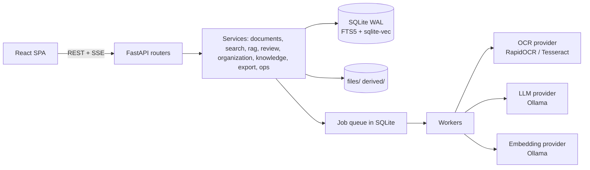
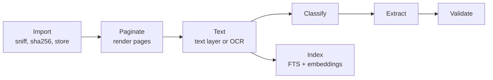

# Architecture

A modular monolith: one Python process serves a React SPA and a JSON/SSE API, runs the background workers, and talks to SQLite and the local filesystem. The only external dependency at runtime is an optional local Ollama server. [BLUEPRINT.md](BLUEPRINT.md) is the original design, and [adr/001-blueprint-corrections.md](adr/001-blueprint-corrections.md) lists where the implementation differs and why.

Layering is `api → services → providers/storage`. Import-linter fails CI if `core`, `storage`, `jobs`, `documents` or `ingestion` import `adstudio.api`. `core/container.py` is the composition root: it wires every service, handler and provider, and tests substitute fakes from `core/fakes.py`.

## Processing pipeline

Each stage is a job in the `jobs` table and is idempotent. Index runs in parallel with classify, extract and validate once text exists.

**Extraction** is where trust is built:
1. Rules extract what they can (regex and normalizers for IDs, dates, amounts, GSTIN, PAN).
2. The LLM is asked only for the fields the rules missed, using a versioned prompt (`ai/prompts`) plus few-shot examples taken from past user corrections.
3. Grounding checks every LLM value against the page's OCR words. A value that doesn't appear is rejected, so the model cannot invent text. Grounded values get a bounding box.
4. Confidence is `min(ocr, extractor)`, multiplied by 0.7 if validation failed.
5. Thresholds (`review.auto_accept` 0.90, `review.soft_review` 0.70) decide whether a field is auto-accepted, soft-flagged or sent to review.

## Storage

- **SQLite, WAL mode.** One serialized writer (`Database.write()` under a lock) and thread-local readers. Schema changes are numbered SQL files applied by `PRAGMA user_version`, with an automatic backup first.
- **FTS5** over page chunks, plus **sqlite-vec** for embeddings. `chunks` uses an `INTEGER PRIMARY KEY` so the FTS rowid is stable across `VACUUM`.
- **Files.** Originals are copied to `files/<2>/<2>/<sha256>.<ext>` and never modified. Page images and OCR output live in `derived/` and can be regenerated.
- **Encryption.** Optional SQLCipher for the database (Argon2id-derived key, optionally cached in the OS keychain). Backups use scrypt + chunked AES-GCM.

## Job queue

Claim with `UPDATE … RETURNING`, heartbeat while running, requeue jobs whose heartbeat is stale, retry with backoff, `NonRetryable` for permanent failures. OCR runs in a spawn-based process pool (Windows-safe) with a per-page timeout and worker kill. `tests/test_crash_recovery.py` kills a worker mid-job and checks the job completes after restart.

## Search and Ask AI

- **Search.** A deterministic query parser turns text such as "invoices from Acme in 2026 above 50,000" into filters. A metadata prefilter narrows candidates, then keyword (BM25) and vector (KNN) results are combined with document-level reciprocal-rank fusion.
- **Ask AI.** Scoped hybrid retrieval of chunks, a grounded prompt with `[S#]` source tags, and streaming over SSE. If retrieval finds nothing the model isn't called. The model answers `NOT_FOUND` when the context can't support an answer. A deterministic post-check removes invalid citations and flags sentences whose numbers or IDs aren't in the cited source.

## Knowledge layer

Extracted party names are resolved to entities using a normalized name, a space-less blocking key (so "A.B.C." matches "ABC") and strong identifiers such as GSTIN. A name the user has corrected is never overridden by an identifier match. Relationships and duplicate/supersedes links are traversed with a bounded BFS.

## Workflows and automation

Rules are JSON (trigger, conditions, actions) edited through a form, not a canvas. A loop guard prevents rules from re-triggering themselves. Webhook actions are off unless enabled in settings. Watch folders import files after a settle delay and can leave, move or delete the source.

## Security model

Loopback only. Each launch mints a one-time token that the launcher exchanges for an HttpOnly session cookie. Requests with a bad Host or Origin are rejected. The optional app lock keeps server-side state and answers 423 to every API call but status/unlock while locked. The CSP is `self` only, and there are no telemetry or third-party calls. Exports escape cells that begin with `=`, `+`, `-` or `@`.

## Frontend

React, TypeScript and Vite, with a small hand-rolled helper layer (`src/lib.ts`) instead of a state or data library. Logic that can be tested without a DOM (review keyboard model, workflow form, SSE parsing, citation splitting) lives in pure modules with Vitest tests. Design tokens are in `src/styles/tokens.css` with light, dark and system themes, a rail layout, a Ctrl/Cmd+K command palette and local fonts only.
