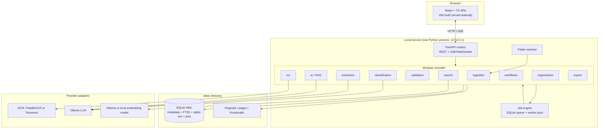
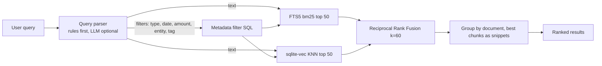
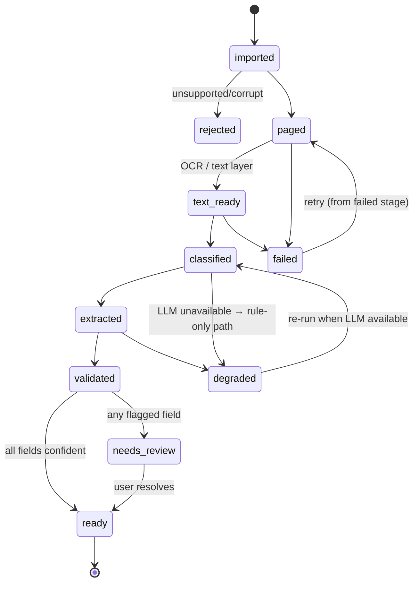

# Lightweight AI Document Intelligence Studio — Technical & Product Blueprint

> Audience: an AI coding agent or small team implementing the product. Functional source of truth was the original requirements doc (not available in this workspace); this blueprint works from the requirements named in the brief and marks inferred items as **[ASSUMED]**.

**Self-challenge result:** "Can this be simpler without losing user value?" Yes, three times over: no separate job process at first (worker threads inside the API process), no SQLCipher requirement in MVP (OS-level disk encryption + optional passphrase-encrypted backups; SQLCipher is a V1 toggle), no visual workflow editor. These are reflected below.

---

## 1. Product Vision

A private, offline-capable **document workspace**: drop documents in, the app reads them (OCR), classifies them, extracts fields, lets you verify the shaky ones against the source page, makes everything searchable, and lets you ask questions with page-level citations. Everything runs on the user's machine; a browser is the UI.

Principles: local-first · no network required · human-in-the-loop over blind automation · one process, one folder, one browser tab · interfaces where replacement is likely, nothing else.

---

## 2. Requirement Reality Check

| # | Original requirement | Verdict | Why |
|---|---|---|---|
| 1 | Windows-only desktop app | **REPLACE** | Local web app + local service is cross-platform; same value. |
| 2 | Plugin framework (manifests, permissions, lifecycle, isolation) | **REPLACE** / **DEFER** | Internal provider interfaces give extensibility. Third-party plugins have no users before the core works. |
| 3 | RBAC | **REMOVE FROM V1** | Single local user. Add later only if multi-user appears. |
| 4 | Multi-user deployment | **REMOVE FROM V1** | Different product (server, sync, conflicts). |
| 5 | Knowledge graph, 100k nodes, 3 hops | **KEEP BUT SIMPLIFY** (V1) | SQLite tables + recursive CTE handle 100k nodes / 3 hops trivially. No graph DB. |
| 6 | 100,000-document scalability | **QUESTION / DEFER** | Design supports it (SQLite+FTS5+sqlite-vec are fine to ~100k docs); only *validate* at 10k in V1. Bottleneck is processing time, not storage. |
| 7 | 100 GB local database | **REPLACE** | Blobs live on the filesystem. DB holds metadata, text, vectors: single-digit GB even at 100k docs. |
| 8 | Visual workflow engine | **REPLACE** | JSON rules (trigger/conditions/actions) + form UI. Node editor is V2+ if ever. |
| 9 | Handwritten OCR | **DEFER** (V2) | Needs specialised models, low accuracy, big review burden. Printed text first. |
| 10 | 9+ languages | **KEEP BUT SIMPLIFY** | Language = OCR language pack + embedding model choice. Ship English + 2–3 (e.g. Hindi, German, Spanish) via config; multilingual embedding model covers search. |
| 11 | Semantic vector search | **KEEP** (MVP) | Core value; sqlite-vec, no vector DB. |
| 12 | AES-256 DB encryption | **KEEP BUT SIMPLIFY** | MVP: data dir on OS-encrypted disk (BitLocker/FileVault/LUKS) + app lock. V1: optional SQLCipher toggle, key in OS keychain. |
| 13 | Encrypted configuration | **SIMPLIFY** | Secrets (only optional cloud API keys) go in OS keychain via `keyring`. Nothing else in config is sensitive. |
| 14 | Audit logging | **KEEP BUT SIMPLIFY** | One append-only `audit_log` table recording user edits/deletes/exports. Not a compliance system. |
| 15 | No telemetry | **MUST KEEP** | Free: build none. |
| 16 | Session locking | **KEEP BUT SIMPLIFY** (V1) | Optional passphrase + idle lock on the UI. |
| 17 | Backup/restore | **KEEP BUT SIMPLIFY** | SQLite online-backup API + zip of `data/`. Manual button + optional schedule. |
| 18 | Watch folders | **KEEP** (V1) | Real value for scan-to-folder flows. `watchdog` + polling fallback. Not MVP (manual import first). |
| 19 | ZIP recursion | **KEEP BUT SIMPLIFY** | Depth ≤3, size/entry-count caps, zip-bomb guard. |
| 20 | Multiple OCR providers | **KEEP BUT SIMPLIFY** | `OCRProvider` interface; ship one engine, second adapter proves the seam. |
| 21 | 16 concurrent workers | **REPLACE** | Pool = `max(1, cores-1)`, capped by RAM; OCR/LLM are the real limits. |
| 22 | 30-second processing SLA | **QUESTION** | Machine-dependent. Reframe as target (§26). |
| 23 | Enterprise plugin permissions | **REMOVE FROM V1** | No third-party code, no sandbox needed. |
| 24 | Collections/Projects/Tags/Templates/Reports/Plugins nav | **SIMPLIFY** | Merge: Tags + Collections (smart, rule-based) ; Projects = a collection; Reports = saved searches + CSV export; Templates = document-type field schemas. |
| 25 | Confidence thresholds | **MUST KEEP** | Drives Review queue, the main differentiator. |
| 26 | Format support (PDF, DOCX, XLSX, PPTX, CSV, JSON, XML, EML, MSG, images) | **KEEP** (staged) | MVP: PDF, images, DOCX, TXT. Rest in V1 (parsers are small). |
| 27 | AI assistant with citations | **MUST KEEP** | Grounding in pages is non-negotiable. |

---

## 3. Simplification Decisions (summary)

1. **One process.** FastAPI serves API + built frontend static files + WebSocket/SSE; a worker thread pool inside it runs jobs. Heavy OCR runs in subprocesses (`ProcessPoolExecutor`) so crashes/leaks don't kill the API.
2. **One database file** (SQLite, WAL mode) for metadata, FTS5, vectors, jobs, chat.
3. **One data directory** holds everything; backup = copy it.
4. **No message broker.** Jobs are rows.
5. **No graph, vector, or search server.**
6. **Providers, not plugins.**
7. **Rules, not a workflow canvas.**
8. **Ollama optional but recommended;** app degrades gracefully (OCR + keyword search + rule-based classification work without any LLM).

---

## 4. Architecture Options Compared

Scale: ●●● good, ●● ok, ● poor.

| Criterion | A. Pure PWA | B. Local web app + local service | C. Tauri/Electron + web | D. Docker local | E. FastAPI + browser (a variant of B) |
|---|---|---|---|---|---|
| Install complexity | ●●● (URL) but useless without backend | ●● (one installer/`pipx`) | ●● (installer, signing) | ● (Docker Desktop, WSL on Windows) | ●● |
| Portability | ●●● | ●●● | ●● (per-OS builds) | ●● | ●●● |
| Filesystem access | ● (File System Access API, Chromium only, no background) | ●●● | ●●● | ●● (volume mounts, path translation) | ●●● |
| Watch folders | ● (impossible in background) | ●●● | ●●● | ●● | ●●● |
| Performance (OCR/AI) | ● (WASM) | ●●● native | ●●● | ●● (GPU passthrough painful) | ●●● |
| Local AI (Ollama) | ●● (CORS/localhost only) | ●●● | ●●● | ●● | ●●● |
| Security | ●●● sandbox | ●● (localhost binding + token) | ●● | ●● | ●● |
| Memory footprint | ●●● | ●●● | ● (Chromium bundled) | ●● (VM overhead) | ●●● |
| Dev complexity | ● (rebuild Python stack in WASM) | ●● | ● (two runtimes + IPC) | ●● | ●● |
| Maintenance | ● | ●●● | ●● | ●● | ●●● |
| Offline | ●●● | ●●● | ●●● | ●●● | ●●● |
| Upgrades | ●●● | ●● (`pipx upgrade` / installer) | ●● (auto-updater work) | ●● | ●● |
| Win/mac/Linux | ●●● | ●●● | ●●● | ●● (Docker friction on Win/mac) | ●●● |
| Fit for this product | ● | ●●● | ●● | ●● | ●●● |

**Decision: B/E (they converge): Python + FastAPI local service serving a React SPA to the user's browser.** C is a later optional wrapper (tray, auto-start); D is an opt-in deployment for power users/NAS.

---

## 5. Recommended Architecture



**Layering rule:** `api → services (domain) → providers/storage`. Domain modules never import FastAPI, and never import concrete providers—only the interfaces in `core/interfaces.py`. Providers are wired in `core/container.py`.

---

## 6. Technology Stack

| Concern | Choice | Why / alternative rejected |
|---|---|---|
| Backend | Python 3.11+, FastAPI, Pydantic v2, SQLAlchemy Core or plain `sqlite3` + small repository layer | Best OCR/ML ecosystem. Node rejected (weaker ML libs). |
| Frontend | React + TypeScript + Vite, TanStack Query, TanStack Table, Zustand (small state), Radix UI primitives + Tailwind, `pdfjs-dist` for preview, `cmdk` for palette | Vite = zero-config build; Radix = accessible primitives. Next.js rejected (needs a server). |
| DB | SQLite (WAL, `foreign_keys=ON`), Alembic or hand-rolled `PRAGMA user_version` migrations | Zero-admin. Postgres rejected. |
| Full-text | FTS5 (`bm25`, `unicode61 remove_diacritics 2`) | Built in. |
| Vectors | `sqlite-vec` (brute-force KNN is fine to ~100k chunks × 768 dims; add int8/binary quantization later) | Chroma/Qdrant rejected (extra process). |
| Jobs | SQLite `jobs` table + `ThreadPool` (I/O, DB) + `ProcessPool` (OCR/image) | Celery/Redis rejected. |
| OCR | **Default: PaddleOCR (PP-OCRv4/5) if install succeeds, else Tesseract 5** — adapter chosen at setup by capability probe. Digital-text PDFs skip OCR entirely (PyMuPDF text layer). | Tesseract is the safe, smaller baseline; Paddle is more accurate on scans/tables but heavier to install on Windows. Validate in Phase 2 on the eval set, don't guess. |
| PDF/render | PyMuPDF (fitz) render + text layer + word boxes | Fast, one dependency. (AGPL license — note in Risks.) |
| Image | Pillow + OpenCV-headless (deskew, denoise, binarize only when OCR confidence is low) | |
| Parsing | `python-docx`, `openpyxl`, `python-pptx`, stdlib `csv/json/xml/zipfile/email`, `extract-msg` | |
| LLM | Ollama HTTP API behind `LLMProvider`; default small instruct model (e.g. 7–8B class), structured output via JSON schema/grammar | Users' hardware varies → model is a setting. |
| Embeddings | Ollama embedding model or `sentence-transformers` multilingual small model behind `EmbeddingProvider` | Record `model_id` + `dim` per vector so re-embedding is detectable. |
| Watcher | `watchdog` + periodic rescan reconciliation (network drives/missed events) | |
| Secrets | `keyring` | |
| Packaging | `pipx install ai-doc-studio` + launcher `adstudio` (MVP); PyInstaller/Briefcase single-file installer (V1) | §18 |
| Tests | pytest, Playwright, Vitest | |

---

## 7. Database Schema (SQLite)

Conventions: `id TEXT PRIMARY KEY` (UUIDv7/ULID, sortable), timestamps as ISO-8601 UTC `TEXT`, JSON in `TEXT` with `json_valid` checks, soft delete via `deleted_at`. All tables `STRICT` where supported.

```sql
-- ── Documents ─────────────────────────────────────────────
CREATE TABLE documents (
  id            TEXT PRIMARY KEY,
  title         TEXT NOT NULL,
  original_name TEXT NOT NULL,
  mime          TEXT NOT NULL,
  size_bytes    INTEGER NOT NULL,
  sha256        TEXT NOT NULL,                 -- dedupe
  source        TEXT NOT NULL,                 -- 'upload'|'watch'|'zip'|'email'
  parent_id     TEXT REFERENCES documents(id), -- ZIP/email attachment parent
  state         TEXT NOT NULL DEFAULT 'imported',  -- see §12 state machine
  state_detail  TEXT,                          -- JSON: failed stage, error, retry count
  doc_type_id   TEXT REFERENCES document_types(id),
  doc_type_conf REAL,
  language      TEXT,
  page_count    INTEGER,
  review_status TEXT NOT NULL DEFAULT 'none',  -- none|needs_review|in_review|reviewed
  current_version INTEGER NOT NULL DEFAULT 1,
  created_at    TEXT NOT NULL,
  updated_at    TEXT NOT NULL,
  deleted_at    TEXT
);
CREATE UNIQUE INDEX ux_documents_sha_live ON documents(sha256) WHERE deleted_at IS NULL;
CREATE INDEX ix_documents_state ON documents(state);
CREATE INDEX ix_documents_type ON documents(doc_type_id);
CREATE INDEX ix_documents_review ON documents(review_status);

-- Versions only when the ORIGINAL file is replaced (rare). Extraction edits are tracked in audit_log.
CREATE TABLE document_versions (
  document_id TEXT NOT NULL REFERENCES documents(id) ON DELETE CASCADE,
  version     INTEGER NOT NULL,
  file_path   TEXT NOT NULL,                   -- relative to data/
  sha256      TEXT NOT NULL,
  created_at  TEXT NOT NULL,
  PRIMARY KEY (document_id, version)
);

CREATE TABLE document_pages (
  id           TEXT PRIMARY KEY,
  document_id  TEXT NOT NULL REFERENCES documents(id) ON DELETE CASCADE,
  page_no      INTEGER NOT NULL,               -- 1-based
  width        REAL, height REAL,              -- in render pixels
  image_path   TEXT,                           -- rendered page (lazy)
  thumb_path   TEXT,
  text         TEXT,                           -- final page text (OCR or text layer)
  text_source  TEXT,                           -- 'text_layer'|'ocr'|'native'
  ocr_conf     REAL,
  UNIQUE (document_id, page_no)
);

-- Word/line boxes for click-to-source highlighting. JSON blob per page keeps row count sane.
CREATE TABLE ocr_results (
  page_id    TEXT PRIMARY KEY REFERENCES document_pages(id) ON DELETE CASCADE,
  provider   TEXT NOT NULL, provider_version TEXT, lang TEXT,
  words_json TEXT NOT NULL,                    -- [{t,x,y,w,h,c,line,block}] normalized 0..1
  created_at TEXT NOT NULL
);

CREATE TABLE document_metadata (               -- key/value for parser-derived props
  document_id TEXT NOT NULL REFERENCES documents(id) ON DELETE CASCADE,
  key TEXT NOT NULL, value TEXT, PRIMARY KEY (document_id, key)
);

-- ── Types & extraction ───────────────────────────────────
CREATE TABLE document_types (
  id TEXT PRIMARY KEY, name TEXT UNIQUE NOT NULL, description TEXT,
  keywords_json TEXT,                          -- cheap rule classifier hints
  fields_json TEXT NOT NULL,                   -- extraction template: [{key,label,kind,required,regex?,validators[]}]
  builtin INTEGER NOT NULL DEFAULT 0, created_at TEXT NOT NULL
);   -- = "extraction_templates": one row per type, no separate table needed

CREATE TABLE extracted_fields (                -- one row per field per document
  id           TEXT PRIMARY KEY,
  document_id  TEXT NOT NULL REFERENCES documents(id) ON DELETE CASCADE,
  key          TEXT NOT NULL,
  raw_value    TEXT,                           -- as read
  value        TEXT,                           -- normalized / user-corrected
  confidence   REAL,                           -- 0..1 combined
  page_no      INTEGER, bbox_json TEXT,        -- source location [x,y,w,h] normalized
  status       TEXT NOT NULL DEFAULT 'auto',   -- auto|needs_review|accepted|corrected|rejected
  flag_reason  TEXT,                           -- 'low_confidence'|'validation_failed'|'missing_required'|'disagreement'
  extractor    TEXT,                           -- 'rule'|'llm:<model>'
  updated_at   TEXT NOT NULL,
  UNIQUE (document_id, key)
);
CREATE INDEX ix_fields_status ON extracted_fields(status);
CREATE INDEX ix_fields_kv ON extracted_fields(key, value);

-- Table-like/repeating data (invoice line items)
CREATE TABLE extracted_rows (
  id TEXT PRIMARY KEY, document_id TEXT NOT NULL REFERENCES documents(id) ON DELETE CASCADE,
  group_key TEXT NOT NULL, row_no INTEGER NOT NULL, cells_json TEXT NOT NULL, page_no INTEGER, confidence REAL
);

-- ── Validation ───────────────────────────────────────────
CREATE TABLE validation_rules (
  id TEXT PRIMARY KEY, doc_type_id TEXT REFERENCES document_types(id),  -- NULL = global
  name TEXT NOT NULL, kind TEXT NOT NULL,     -- 'regex'|'checksum'|'range'|'cross_field'|'builtin'
  config_json TEXT NOT NULL, severity TEXT NOT NULL DEFAULT 'warn', enabled INTEGER NOT NULL DEFAULT 1
);
CREATE TABLE validation_results (
  id TEXT PRIMARY KEY, document_id TEXT NOT NULL REFERENCES documents(id) ON DELETE CASCADE,
  rule_id TEXT NOT NULL, field_key TEXT, passed INTEGER NOT NULL, message TEXT, created_at TEXT NOT NULL
);

-- ── Organization ─────────────────────────────────────────
CREATE TABLE tags (id TEXT PRIMARY KEY, name TEXT UNIQUE NOT NULL, color TEXT);
CREATE TABLE document_tags (document_id TEXT REFERENCES documents(id) ON DELETE CASCADE,
  tag_id TEXT REFERENCES tags(id) ON DELETE CASCADE, PRIMARY KEY (document_id, tag_id));

CREATE TABLE collections (                     -- manual or smart (rule-based); also serves as "Projects"
  id TEXT PRIMARY KEY, name TEXT NOT NULL, kind TEXT NOT NULL,   -- 'manual'|'smart'
  query_json TEXT,                             -- saved search filter for smart collections
  created_at TEXT NOT NULL
);
CREATE TABLE collection_documents (collection_id TEXT REFERENCES collections(id) ON DELETE CASCADE,
  document_id TEXT REFERENCES documents(id) ON DELETE CASCADE, PRIMARY KEY (collection_id, document_id));
-- 'collection_rules' folded into collections.query_json (simplification)

-- ── Knowledge relationships (V1) ─────────────────────────
CREATE TABLE entities (
  id TEXT PRIMARY KEY, kind TEXT NOT NULL,     -- 'organization'|'person'|'product'|'location'|...
  canonical_name TEXT NOT NULL, attrs_json TEXT, created_at TEXT NOT NULL,
  UNIQUE (kind, canonical_name)
);
CREATE TABLE entity_aliases (entity_id TEXT REFERENCES entities(id) ON DELETE CASCADE,
  alias TEXT NOT NULL COLLATE NOCASE, PRIMARY KEY (entity_id, alias));
CREATE TABLE document_entities (
  document_id TEXT REFERENCES documents(id) ON DELETE CASCADE,
  entity_id   TEXT REFERENCES entities(id) ON DELETE CASCADE,
  role TEXT,                                   -- 'vendor'|'customer'|'party'...
  field_id TEXT REFERENCES extracted_fields(id) ON DELETE SET NULL,
  PRIMARY KEY (document_id, entity_id, role)
);
CREATE TABLE relationships (
  id TEXT PRIMARY KEY,
  src_entity_id TEXT NOT NULL REFERENCES entities(id) ON DELETE CASCADE,
  dst_entity_id TEXT NOT NULL REFERENCES entities(id) ON DELETE CASCADE,
  kind TEXT NOT NULL,                          -- 'supplies'|'party_to'|'references'|'supersedes'
  evidence_document_id TEXT REFERENCES documents(id) ON DELETE SET NULL,
  confidence REAL, created_at TEXT NOT NULL
);
CREATE INDEX ix_rel_src ON relationships(src_entity_id, kind);
CREATE INDEX ix_rel_dst ON relationships(dst_entity_id, kind);
-- Doc↔doc links (duplicate, supersedes, "related") stored as relationships between document-entities OR:
CREATE TABLE document_links (a TEXT, b TEXT, kind TEXT, score REAL, PRIMARY KEY (a,b,kind));

-- ── Search ───────────────────────────────────────────────
CREATE TABLE chunks (                          -- retrieval unit (≈300–500 tokens, page-anchored)
  id TEXT PRIMARY KEY, document_id TEXT NOT NULL REFERENCES documents(id) ON DELETE CASCADE,
  page_no INTEGER NOT NULL, ord INTEGER NOT NULL, text TEXT NOT NULL,
  char_start INTEGER, char_end INTEGER, bbox_json TEXT
);
CREATE VIRTUAL TABLE chunks_fts USING fts5(text, content='chunks', content_rowid='rowid',
  tokenize='unicode61 remove_diacritics 2');    -- + triggers to sync
CREATE VIRTUAL TABLE chunk_vec USING vec0(chunk_id TEXT PRIMARY KEY, embedding float[768]);
CREATE TABLE embedding_models (id TEXT PRIMARY KEY, name TEXT, dim INTEGER, created_at TEXT); -- detect re-embed need
CREATE TABLE saved_searches (id TEXT PRIMARY KEY, name TEXT, query_json TEXT, created_at TEXT);
CREATE TABLE search_history (id INTEGER PRIMARY KEY AUTOINCREMENT, q TEXT, created_at TEXT);

-- ── Automation ───────────────────────────────────────────
CREATE TABLE workflows (
  id TEXT PRIMARY KEY, name TEXT NOT NULL, enabled INTEGER NOT NULL DEFAULT 1,
  definition_json TEXT NOT NULL,               -- see §13
  created_at TEXT NOT NULL, updated_at TEXT NOT NULL
);
CREATE TABLE workflow_runs (
  id TEXT PRIMARY KEY, workflow_id TEXT REFERENCES workflows(id) ON DELETE CASCADE,
  document_id TEXT REFERENCES documents(id) ON DELETE SET NULL,
  status TEXT NOT NULL, log_json TEXT, started_at TEXT, finished_at TEXT
);
CREATE TABLE watch_folders (id TEXT PRIMARY KEY, path TEXT NOT NULL UNIQUE, recursive INTEGER DEFAULT 1,
  enabled INTEGER DEFAULT 1, after_import TEXT DEFAULT 'leave');  -- leave|move|delete

-- ── Jobs (durable queue) ─────────────────────────────────
CREATE TABLE jobs (
  id TEXT PRIMARY KEY, kind TEXT NOT NULL,     -- 'stage:ocr'|'stage:extract'|'reindex'|'backup'|...
  document_id TEXT REFERENCES documents(id) ON DELETE CASCADE,
  payload_json TEXT, status TEXT NOT NULL DEFAULT 'queued',  -- queued|running|done|failed|cancelled
  priority INTEGER NOT NULL DEFAULT 5, attempts INTEGER NOT NULL DEFAULT 0, max_attempts INTEGER NOT NULL DEFAULT 3,
  run_after TEXT, locked_by TEXT, locked_at TEXT, heartbeat_at TEXT,
  error TEXT, progress REAL, created_at TEXT NOT NULL, finished_at TEXT
);
CREATE INDEX ix_jobs_claim ON jobs(status, priority, run_after);

-- ── AI chat ──────────────────────────────────────────────
CREATE TABLE ai_conversations (id TEXT PRIMARY KEY, title TEXT, scope_json TEXT, -- {document_ids|collection_id|all}
  created_at TEXT, updated_at TEXT);
CREATE TABLE ai_messages (id TEXT PRIMARY KEY, conversation_id TEXT REFERENCES ai_conversations(id) ON DELETE CASCADE,
  role TEXT NOT NULL, content TEXT NOT NULL, citations_json TEXT,   -- [{chunk_id,doc_id,page,quote}]
  model TEXT, created_at TEXT);

-- ── System ───────────────────────────────────────────────
CREATE TABLE settings (key TEXT PRIMARY KEY, value_json TEXT NOT NULL, updated_at TEXT);
CREATE TABLE audit_log (id INTEGER PRIMARY KEY AUTOINCREMENT, at TEXT NOT NULL, action TEXT NOT NULL,
  target_type TEXT, target_id TEXT, before_json TEXT, after_json TEXT);
```

Deliberately **not** created: `entity_values` (folded into `extracted_fields`), `layout_elements` (block/line info lives in `ocr_results.words_json`; a real layout model is V2), `extraction_templates` (= `document_types.fields_json`), `collection_rules` (= `collections.query_json`), `search_index` (= `chunks_fts` + `chunk_vec`), `document_pages` for non-paginated formats use a single synthetic page.

Migrations: `PRAGMA user_version` + ordered `migrations/NNN_name.sql`; backup DB automatically before applying.

---

## 8. Storage Architecture

```text
<data-root>/                 # default: ~/AI-Document-Studio (Windows: %USERPROFILE%\AI-Document-Studio)
├── db/studio.sqlite (+ -wal, -shm)
├── files/
│   └── ab/cd/<sha256>.<ext>     # content-addressed originals (immutable, dedupes for free)
├── derived/<doc_id>/            # regenerable: pages/0001.webp, thumbs/0001.webp, text.json
├── backups/                     # sqlite backups + zips
├── inbox/                       # default watch folder (optional)
├── models/                      # optional local embedding/OCR model cache
├── logs/                        # rotating app.log (no document content in logs)
└── config.toml                  # non-secret settings (port, data paths, worker count, providers)
```

- **SQLite**: everything queryable and small. **Filesystem**: originals and anything large or regenerable.
- `derived/` can be deleted at any time; it is rebuilt lazily → backups may exclude it.
- Originals are never mutated. "Move to folder" workflow actions operate on *user-visible export/organization targets*, or create a link/copy; the content-addressed store stays intact.
- Path handling via `pathlib` only; store relative paths in DB; data-root is a single setting (portable, relocatable).

---

## 9. AI Architecture

```python
# core/interfaces.py
class OCRProvider(Protocol):
    name: str
    def capabilities(self) -> OCRCaps: ...                       # langs, handwriting, tables
    def recognize(self, image: bytes, lang: list[str]) -> OCRPage: ...   # words w/ boxes + conf

class LLMProvider(Protocol):
    def chat(self, messages, *, schema: dict | None = None, temperature=0.0, stream=False) -> Iterator[str] | str: ...
    def health(self) -> ProviderHealth: ...

class EmbeddingProvider(Protocol):
    model_id: str; dim: int
    def embed(self, texts: list[str], *, kind: Literal["doc","query"]) -> list[list[float]]: ...

class DocumentClassifier(Protocol):
    def classify(self, doc: DocText, types: list[DocType]) -> Classification: ...   # type, confidence, evidence

class DocumentExtractor(Protocol):
    def extract(self, doc: DocText, doc_type: DocType) -> list[FieldResult]: ...    # value, conf, page, bbox

class Validator(Protocol):  def validate(self, fields, doc_type) -> list[ValidationResult]: ...
class Exporter(Protocol):   def export(self, docs, fmt, dest) -> Path: ...
class WorkflowAction(Protocol): def run(self, ctx, params) -> ActionResult: ...
```

Concrete: `PaddleOCRProvider`, `TesseractProvider`, `OllamaLLM`, `OllamaEmbedding`/`SentenceTransformerEmbedding`, `RuleClassifier`, `LLMClassifier`, `HybridExtractor` (regex/rules first, LLM for the rest).

**Classification** (cheap → expensive): (1) filename/keyword rules from `document_types.keywords_json`; (2) embedding similarity of first-page text to type descriptions/examples; (3) LLM with JSON schema only if (1)+(2) disagree or are low-confidence. User corrections become few-shot examples (stored per type).

**Extraction**: for each field in the type template — rule/regex candidates → LLM structured-output pass over relevant pages (prompt includes only page text + field schema, temperature 0) → **grounding step**: the returned value must be found in OCR words (fuzzy match); the matched word boxes give `page_no` + `bbox`. Values that cannot be located in the source are flagged `disagreement` and forced to review. This grounding is what makes click-to-source and hallucination detection work.

**Confidence** (per field) = `min(ocr_conf_of_matched_words, extractor_conf)` × validation multiplier (0.7 if a validator fails). Extractor conf: rule match = 0.9; LLM = calibrated from agreement of two passes or logprobs if available [ASSUMED: calibrate on eval set in Phase 3]. Thresholds are settings: `≥ 0.90 auto-accept`, `0.70–0.90 needs review (soft)`, `< 0.70 needs review (blocking)`.

**Without an LLM**: rule classifier + regex extraction + keyword search still work; UI shows "Connect a local model to enable Ask AI and smarter extraction."

---

## 10. OCR Strategy

1. **Skip OCR when possible**: PDF with a text layer of adequate density → use PyMuPDF text + word boxes. DOCX/XLSX/etc. → native text.
2. Scanned PDF/images: render at 200–300 DPI (adaptive), run provider per page.
3. **Enhance only on demand**: if page mean confidence < 0.75, retry once with deskew/denoise/binarize (OpenCV), keep the better result.
4. Per-page results cached (`ocr_results`) keyed by `(page, provider, version, lang)`. Re-OCR only on user request or provider change.
5. Language: user default set(s) in Settings; auto-detect (lightweight `lingua`/`langdetect` on first-pass text) suggests a switch. Handwriting = V2 (adapter capability flag `handwriting`).
6. Runs in a `ProcessPoolExecutor` (per-process model load; pool size limited by RAM, default 2).
7. Tables: MVP treats table text as text; V1 adds table-structure recovery for invoices' line items (PaddleOCR PP-Structure or LLM over positioned words).

---

## 11. RAG & Search Architecture

**Indexing** (per document, after extraction): page text → chunks (≈350 tokens, 50 overlap, never crossing a page boundary; each chunk keeps `page_no` + bbox union) → insert into `chunks` (FTS triggers) → embed in batches → `chunk_vec`. Also index extracted field values into a small `field_fts` (so "ABC Pvt Ltd" hits vendor field directly).

**Query pipeline**



- **Query understanding**: deterministic parser handles `in 2026`, `above ₹50,000`, `from ABC`, `type:invoice`, `tag:`, `before:`; unresolved text goes to lexical+semantic. Optional LLM rewrites NL → the same JSON filter schema (validated, never executed as SQL). Parsed filters are shown as removable chips so the user always sees what was understood.
- **Fusion**: RRF (no score calibration needed). Filters applied *before* KNN via a `rowid IN (…)` prefilter set.
- **RAG (Ask AI)**: scope (this doc / selection / collection / all) → hybrid retrieve top ~8–12 chunks → (optional rerank by LLM score, V1) → prompt with numbered sources `[S1]…` → LLM must answer only from sources, cite `[S#]`, say "not found" otherwise → post-check: every citation index exists; each cited sentence's key tokens overlap the cited chunk (cheap faithfulness check); citations render as `Doc name, p.7` chips that open the preview at the highlighted chunk.
- **Compare documents**: retrieve per-document for the same aspect list (payment terms, termination, liability…), extract each into a small schema, then diff the structured results; the LLM writes the narrative from the diff only.
- **Discrepancy detection**: cross-field validation (totals, dates) + entity mismatch across linked documents (PO vs invoice) — deterministic first, LLM explains.

---

## 12. Processing Pipeline & State Machine

Stages (M = mandatory, O = optional):

| # | Stage | | Notes | Parallel? | Cached artifact |
|---|---|---|---|---|---|
| 1 | Import + validate (type sniff, size, sha256, dedupe, ZIP expand) | M | magic-bytes not extension | per file | original in `files/` |
| 2 | Metadata + page split/render | M | | per page | `derived/pages` |
| 3 | Enhance | O | only if low OCR conf | per page | |
| 4 | Text acquisition (text layer or OCR) | M | | per page (process pool) | `ocr_results`, `pages.text` |
| 5 | Layout hints | O (V2) | | | |
| 6 | Classify | M | | per doc | `documents.doc_type_*` |
| 7 | Extract | M if type has fields | | per doc | `extracted_fields` |
| 8 | Validate | M | deterministic, cheap | | `validation_results` |
| 9 | Index (chunk + FTS) | M | makes doc searchable **early**, right after stage 4 | | `chunks` |
| 10 | Embed | O | slower; doc is keyword-searchable before this | batches | `chunk_vec` |
| 11 | Relationships (entities) | O (V1) | | | |
| 12 | Organization rules + workflows | O (V1) | | | |
| ✔ | Ready / needs_review | | | | |

Ordering tweak vs. the brief: **index (FTS) right after text acquisition** and embed in parallel with classification/extraction, so documents become searchable in seconds even if the LLM is slow.



`documents.state` = coarsest completed milestone; `state_detail` = `{stage, error, attempts}`. A partially processed doc is fully usable: preview always works; search works from `text_ready`; UI shows a stage progress strip and per-stage status.

**Reliability**
- Each stage = one job row; a stage is **idempotent** (writes results in one transaction, keyed by doc+stage; re-run overwrites).
- Claim: `UPDATE jobs SET status='running', locked_by=?, heartbeat_at=now WHERE id=(SELECT id … WHERE status='queued' AND run_after<=now ORDER BY priority, created_at LIMIT 1) RETURNING *`.
- Heartbeat every 10 s; on startup (and every minute) requeue `running` jobs whose heartbeat is stale → **restart recovery is automatic**.
- Retries: 3 attempts, exponential backoff (5 s, 30 s, 5 min); non-retryable errors (corrupt file, password-protected) fail immediately with an actionable message ("Enter password", "Re-scan file").
- Failure isolation: a failed doc/stage never blocks the queue; stage N failing doesn't discard stages < N. Poison-pill guard: OCR in subprocess with timeout (per-page 120 s default).
- Concurrency limits per resource class: `ocr` (default 2), `llm` (default 1, GPU/CPU bound), `embed` (1), `io` (4). Fair scheduling: interactive user actions (priority 1) jump ahead of bulk imports (priority 5).

---

## 13. Workflow Architecture (V1: rules, not a canvas)

```json
{
  "name": "File invoices",
  "trigger": {"event": "document.ready"},
  "conditions": {"all": [
    {"field": "doc_type", "op": "eq", "value": "Invoice"},
    {"field": "field:total", "op": "gt", "value": 50000}
  ]},
  "actions": [
    {"type": "apply_tag", "tag": "invoice"},
    {"type": "add_to_collection", "collection": "Finance 2026"},
    {"type": "export_copy", "target": "D:/Accounting/Invoices", "template": "{vendor}/{invoice_date:%Y-%m}/{original_name}"},
    {"type": "notify", "message": "High-value invoice"}
  ]
}
```

- Events: `document.imported | classified | extracted | ready | needs_review | review.resolved`.
- Operators: `eq ne gt gte lt lte contains matches in exists`. Groups: `all` / `any` / nested `not`.
- Actions are `WorkflowAction` implementations in a registry: `apply_tag, remove_tag, add_to_collection, set_field, export_copy, move_managed_file, webhook (off by default; network), notify, run_export`.
- Form-driven builder (rows: "When… / If… / Then…") writes this JSON; a "Test on this document" dry-run shows what would happen. Runs are logged to `workflow_runs`. Actions are idempotent; loop guard = max 1 run per (workflow, document, event).
- Visual node editor: revisit only if users regularly need branching/loops (→ V2+).

---

## 14. API Specification

Base: `http://127.0.0.1:<port>/api/v1`. JSON. Errors: RFC 7807 `{type,title,detail,code}`. Pagination: cursor (`?cursor=&limit=`). All mutations return the updated resource.

**Documents**
```
POST   /documents/import            multipart files[] | JSON {paths[]} (local paths, server-side)   → {job_ids, document_ids}
GET    /documents                   ?q&type&state&review&tag&collection&from&to&sort&cursor
GET    /documents/{id}              detail incl. state, pages summary
DELETE /documents/{id}              soft delete;  POST /documents/{id}/restore
POST   /documents/{id}/reprocess    {from_stage?, options?}
GET    /documents/{id}/file         original (Range supported)
GET    /documents/{id}/pages/{n}/image?w=  |  /pages/{n}/text  |  /pages/{n}/words
GET    /documents/{id}/fields       extracted fields + validation status
PATCH  /documents/{id}/fields/{key} {value?, status: accepted|corrected|rejected}
POST   /documents/{id}/fields/{key}/rerun  re-extract one field (optional region bbox)
PATCH  /documents/{id}             {title?, doc_type_id?, tags?}
POST   /documents/bulk             {ids[], action: tag|untag|delete|reprocess|export|accept_all_confident}
```
**Review**: `GET /review/queue?type&min_conf` (next-item ordering), `POST /review/{doc_id}/complete`.
**Search**: `POST /search {q, filters, mode?, limit}` → `{parsed_filters, results[{doc, score, snippets[{page,text,highlights}]}]}`; `GET /search/suggest?q`; `GET|POST|DELETE /search/saved`; `GET /search/history`.
**Ask AI**: `POST /chat {conversation_id?, scope, message}` → **SSE** stream: `event: token`, `event: citation {chunk,doc,page,bbox}`, `event: done`. `GET /chat/conversations[/{id}]`.
**Organization**: `/tags`, `/collections` (CRUD; `/collections/{id}/documents`), `/document-types` (CRUD incl. field schema + `POST /document-types/{id}/test`).
**Automation**: `/workflows` CRUD, `POST /workflows/{id}/run {document_id, dry_run}`, `GET /workflows/{id}/runs`; `/watch-folders` CRUD.
**Knowledge (V1)**: `GET /entities?q`, `GET /entities/{id}` (docs + relations), `GET /entities/{id}/graph?depth=1..3`.
**System**: `GET /jobs?status`, `GET /jobs/{id}`, `POST /jobs/{id}/cancel|retry`; `GET|PATCH /settings`; `GET /health` (providers: ocr, llm, embed status); `POST /backup`, `POST /restore`; `POST /export`; `GET /audit`.
**Realtime**: `GET /events` (SSE, single multiplexed stream): `job.updated`, `document.state`, `review.queue_changed`, `notification`. (SSE over WebSocket: simpler, auto-reconnect, works with proxies; chat streaming is its own SSE response.)

Auth: random per-install token in an HttpOnly, SameSite=Strict cookie, set when the launcher opens the browser via a one-time URL; API binds to `127.0.0.1` only; `Host`/`Origin` checks defeat DNS-rebinding and drive-by requests from other sites.

---

## 15. UI / UX Architecture

**Information architecture** (left rail, collapsible; command palette `Ctrl/Cmd+K` is the universal navigator):

```
Home · Documents · Search · Review (badge) · Ask AI · Automations · Settings
```
Collections/tags/document types appear as **filters and saved views inside Documents** (sidebar list), not top-level pages. Knowledge relationships appear inside Document Detail ("Related") and as an entity page reachable from any entity chip (V1). Reports = saved searches + Export. Plugins: absent.

**Home**: (1) big search/command bar; (2) *Needs your review* (count, oldest, "Start review" primary button); (3) *Processing* live strip (progress, ETA, failures with retry); (4) Recent documents; (5) drop zone / "Import" and connected watch folders; (6) Ask AI entry ("Ask across N documents"). Empty state: a single drop zone + sample-document button.

**Documents**: dense table (title, type, status, confidence dot, key field summary column configurable per type, tags, date). Type-ahead filter bar with chips (type, state, review, tag, date, amount). Multi-select → contextual bulk bar (tag, add to collection, reprocess, export, delete). `Space` = quick-look preview drawer; `Enter` = open; `j/k` navigate. Virtualized rows (10k+).

**Document Detail (the key screen)**

```
┌ Header: title · type ▾ · status · confidence · [Reprocess] [Export] [⋯] ───────────┐
├──────────────────────────────┬────────────────────────────────────────────────────┤
│ Viewer (pdf.js)              │ Tabs: Fields │ Text │ Related │ History             │
│  page thumbs · zoom · search │ ── Fields ──                                        │
│  overlay boxes: green=ok     │ Invoice No   INV-20491        98% ✓                 │
│  amber=review, red=invalid   │ Vendor       ABC Pvt Ltd      96% ✓                 │
│  active field's box pulses   │ GSTIN ⚠      27ABCDE1234F1Z5  72%  "Checksum fails" │
│                              │   [Accept] [Edit] [Reject] [Re-extract region]      │
├──────────────────────────────┴────────────────────────────────────────────────────┤
│ Ask about this document…  (scoped chat, citations jump to page+box)                │
└────────────────────────────────────────────────────────────────────────────────────┘
```

**Review workflow (differentiator)**
- Entering Review opens the first flagged field with the viewer auto-scrolled and the source box highlighted; the panel shows *why flagged* ("Low OCR confidence in 3 characters", "GSTIN checksum invalid", "Value not found in page", "Required field missing").
- Actions: **Accept** (`Enter`), **Edit** (`E`, inline, validated live), **Reject** (`Backspace`), **Next flagged** (`Tab`/`J`), **Re-extract region** (`R`: draw a box on the page → OCR/LLM only that region → fills the field), **Accept all ≥ threshold** (bulk). Correcting or drawing a box teaches nothing magically, but stores the correction as a few-shot example for that document type (V1) and increments a correction-rate metric.
- Undo for every action (`Ctrl+Z`), backed by `audit_log`.
- Progress: "12 of 37 fields left · 3 documents in queue".
- Multi-document review queue sorted by (blocking flags first, oldest).

**Search**: single input; parsed filter chips appear inline (removable); segmented control Best match / Keyword / Meaning; result = document row + 1–3 highlighted snippets with page numbers; hover/`Space` previews at the matched page; suggestions from recent searches, entities, types; "Save search" → appears in sidebar (doubles as a smart collection).

**Ask AI**: full page with scope selector ("All documents", collection, or pinned docs), streaming answer, **citation chips** `[Contract A · p.7]`, click → side viewer at highlighted passage; "Compare" template (pick 2+ docs → structured table of aspects) ; conversations list; "Not found in your documents" is a first-class answer. Model/health indicator with a fix-it link when Ollama is down.

**Automations**: list of rules with last-run status; editor = When/If/Then form + "Test on a document"; watch folders section.

**Settings**: Library location, Watch folders, Models (Ollama URL, model pickers, health checks, "Test"), OCR (languages, engine), Review thresholds, Document types (field schema editor), Security (app lock, encryption), Backup/Restore, Appearance/Shortcuts, About/Logs.

**States**: skeleton loaders shaped like the final content; per-item progress; errors always offer a next action (Retry / Open logs / Enter password / Skip). Empty states explain the next step and provide the primary button.

---

## 16. Design System (lightweight)

Feel: calm, technical, premium, document-centric. The document is the hero; chrome recedes.

- **Type**: UI = Inter (variable) 13/14 px base; document text & values = same family with tabular numerals for amounts; mono (JetBrains Mono) for IDs/hashes only. Scale (px): 12 / 13 / 14 / 16 / 20 / 28. Weights 400/500/600. Line-height 1.4–1.5. Respects user font-size (rem-based).
- **Spacing**: 4-pt scale: 4, 8, 12, 16, 24, 32, 48.
- **Radii**: 4 (inputs, badges), 6 (buttons), 10 (dialogs/popovers). **Borders**: 1 px hairlines carry structure; **shadows** only for floating layers (popover/dialog/palette): `0 8px 24px rgb(0 0 0 / .12)`. No card grids; use dividers and whitespace.
- **Color tokens** (light / dark; semantic, not decorative):
  - `--bg` #FAFAF9 / #0F1012 · `--surface` #FFFFFF / #16181B · `--surface-2` #F3F3F1 / #1D2024 · `--border` #E4E4E0 / #2A2D32
  - `--text` #1A1A18 / #ECECEA · `--text-muted` #6B6B66 / #9A9A94
  - `--accent` #3B5BDB / #7C93F5 (single accent, used for focus, primary action, selection)
  - Status: `--ok` #2F9E44, `--warn` #E8890C, `--danger` #D6336C, `--info` #1C7ED6 (each with a `-bg` tint at ~10% for badges). All text/background pairs ≥ WCAG AA 4.5:1 (verify in CI with an automated contrast test).
- **Confidence indicator**: never color-only. Pattern = small bar/dot **+ number + icon** (`✓` ≥ .90, `!` .70–.90, `⚠` < .70). Same visual on field rows, table column, and PDF box outlines (solid=ok, dashed=review).
- **Icons**: Lucide, 16 px, 1.5 stroke.
- **Components**: Button (primary/secondary/ghost/danger; sizes sm/md), Input/Select/Combobox, Checkbox/Switch, Table (sticky header, virtualized, row hover, keyboard selection), Badge (status), Tabs, Tooltip, Dialog, Drawer, Toast (bottom-right, actionable, auto-dismiss 5 s, `aria-live=polite`), Command palette (`cmdk`: navigation, actions on selection, recent docs, "Ask AI: …"), Empty state, Skeleton, Progress strip.
- **Motion**: 120–180 ms ease-out on opacity/transform only; honors `prefers-reduced-motion`.
- **Shortcuts (global)**: `Ctrl/Cmd+K` palette · `/` focus search · `g h/d/s/r/a` go to · `?` shortcut sheet · `Ctrl+Shift+I` import. Contextual: see Review/Documents above.
- Themes: system / light / dark via CSS variables; density toggle (comfortable/compact).

**Accessibility**: semantic landmarks (`nav/main/aside`), tables use real `<table>` semantics (or `role=grid` with roving tabindex when virtualized), visible 2 px focus ring (`--accent`, offset 2), full keyboard operability (no hover-only actions; every pointer action has a key path), focus trapped in dialogs and restored on close, live regions for job/toast updates, box overlays on PDF exposed as a list in the Fields panel (screen-reader path), ≥ 44 px touch targets where applicable, zoom to 200% without loss, `prefers-reduced-motion` and `prefers-contrast` respected. axe-core in Playwright tests.

---

## 17. Security Model

Threat model: single user on their own machine; adversaries = other local users/processes, malicious web pages hitting localhost, lost/stolen device, malicious documents.

| Area | V1 design |
|---|---|
| Network exposure | Bind `127.0.0.1`; random port default; token cookie; strict `Host`/`Origin` checks; CORS disabled; CSP on the SPA. LAN access is an explicit opt-in (V2) with password. |
| Authentication | MVP: launcher-issued session token (above). V1: optional **app passphrase** (Argon2id) + idle auto-lock (UI locks; API rejects until unlock). |
| Encryption at rest | MVP: recommend OS full-disk encryption (setup screen checks BitLocker/FileVault/LUKS status and nudges). V1: optional **SQLCipher (AES-256)** DB + AES-GCM encrypted `files/` (per-file, key from passphrase via KDF, or OS keychain). Decision is a toggle because it costs performance and complicates recovery — see ADR-12. |
| Secrets | `keyring` (Windows Credential Manager / Keychain / Secret Service). None needed for local-only use. |
| Audit | `audit_log` for edits/deletes/exports/settings changes; viewable in Settings; export to CSV. |
| Privacy | No telemetry, no update pings unless the user clicks "Check for updates"; the network-touching features (webhook action, cloud LLM provider if ever added, update check) are off by default and labeled. Logs never contain document text. |
| Untrusted files | Parse in subprocess with timeouts and memory caps; zip-bomb limits (ratio, count, depth, total bytes); path-traversal-safe extraction; never execute macros; Office parsers only read; PDF rendering via MuPDF (no JS). Preview images served as raster, not raw HTML. Prompt-injection: document text is passed as quoted data; LLM has no tools/network in extraction/RAG; outputs validated against schema; workflow actions triggered by rules, never by model output. |
| Multi-user / RBAC | Not built. Path: add `users`, `roles`, `owner_id` on documents/collections, per-request identity, and move to Postgres only if concurrent multi-user is real. Schema uses `id` TEXT keys and `audit_log` so this is additive. |

---

## 18. Deployment Model

**MVP:** `pipx install ai-doc-studio` (or `uv tool install`) → run `adstudio` → it (1) creates the data dir, (2) runs migrations, (3) probes OCR engines/Ollama, (4) starts uvicorn on 127.0.0.1, (5) opens the default browser to `http://127.0.0.1:<port>/?t=<one-time>`. Setup wizard in the browser: pick library folder → detect/offer Ollama + model pull → choose languages → done. Wheel bundles the pre-built frontend (`frontend/dist` copied into the Python package at release time), so **no Node needed at runtime**.

**V1:** signed single-file installers via PyInstaller or Briefcase (Windows `.exe`/MSIX, macOS `.dmg`, Linux AppImage) that include Python, OCR engine, and launcher; tray icon (optional) via `pystray`; autostart option.

**Optional:** `docker compose up` (image with backend+frontend; Ollama as second service or host-network) for NAS/power users. **Later:** Tauri wrapper that spawns the same service and hosts the same SPA (tray, native notifications, file associations), no code changes to core.

Upgrades: `pipx upgrade` / installer; DB migrations run at start after auto-backup. Uninstall leaves the data dir untouched. Dev: `make dev` (uvicorn --reload + vite dev server proxy).

**Cross-platform**: `pathlib`, no `os.system`, filesystem watcher via `watchdog` behind a `FolderWatcher` interface + reconcile-scan; no Windows-only APIs in domain code; CI matrix (windows, macos, ubuntu).

---

## 19. Repository Structure

```text
ai-document-studio/
├── backend/
│   ├── pyproject.toml
│   └── adstudio/
│       ├── main.py                 # launcher + app factory
│       ├── api/                    # routers only (thin): documents, search, chat, review, jobs, settings, workflows, events
│       ├── core/                   # config, container (DI), interfaces.py, events bus, errors, security
│       ├── storage/                # db.py (connection, pragmas), migrations/, repositories, filestore.py
│       ├── ingestion/              # sniff, importers, zip, watcher
│       ├── documents/              # domain services, state machine
│       ├── ocr/                    # providers/{paddle,tesseract}.py, enhance.py, textlayer.py
│       ├── classification/         # rule.py, llm.py, hybrid.py
│       ├── extraction/             # templates.py, rules.py, llm.py, grounding.py, confidence.py
│       ├── validation/             # builtin validators (GSTIN, IBAN, dates, totals)
│       ├── search/                 # chunker.py, indexer.py, hybrid.py, query_parser.py
│       ├── ai/                     # providers/{ollama.py,...}, rag.py, compare.py, prompts/
│       ├── knowledge/              # entity resolution + graph queries (V1)
│       ├── workflows/              # rules engine, actions/
│       ├── organization/           # tags, collections
│       ├── export/                 # csv/json/xlsx exporters
│       └── jobs/                   # queue.py, worker.py, recovery.py, scheduler.py
├── frontend/
│   └── src/
│       ├── app/ (router, providers, shell)  ├── components/ (design system)
│       ├── features/{documents,detail,review,search,chat,automations,settings,home}/
│       ├── hooks/  ├── lib/ (api client, sse, keyboard)  └── styles/tokens.css
├── evals/                          # datasets + scripts (see §25)
├── tests/                          # backend unit/integration; e2e/ (Playwright)
├── scripts/                        # dev, release, sample-data
├── docs/                           # BLUEPRINT.md, ADRs
├── Makefile · .github/workflows/ci.yml · README.md
```
Import rule (enforced with `import-linter`): `api → services → interfaces`; modules don't import each other's internals; only `core.interfaces` types cross module boundaries.

---

## 20. Development Phases

Each phase ships something usable and ends with green tests. "Not yet" = explicitly out of scope.

**Phase 0 — Foundation (≈1 wk)**
- Build: repo, CI (3 OS), FastAPI skeleton, config, container/DI, SQLite connection + migration runner, job queue + worker + recovery, SSE `/events`, launcher + token auth, frontend shell (nav, tokens, command palette stub), `make dev`.
- DB: `settings`, `jobs`, `audit_log`. API: `/health`, `/settings`, `/jobs`, `/events`. UI: shell + Settings (empty) + health banner.
- Tests: migration up, job claim/heartbeat/recovery (kill worker mid-job), token/Origin checks.
- Done when: `adstudio` opens the browser, a dummy job survives a process kill and finishes.
- Not yet: any document logic.

**Phase 1 — Ingestion, storage, preview (≈1–2 wks)**
- Build: import (drag/drop + path), type sniff, sha256 dedupe, content-addressed store, page render/thumbnail (PyMuPDF; images; DOCX→text-only preview initially), Documents list, detail viewer.
- DB: `documents`, `document_versions`, `document_pages`, `document_metadata`. API: `/documents*` basics, file/page image endpoints. UI: Home (recent + drop zone), Documents table, Detail viewer (no fields).
- Tests: corrupt/encrypted/huge PDF, duplicate import, ZIP bomb, path traversal; e2e import→preview.
- Done when: import 200 mixed files without crash; preview < 1 s per page after first render.
- Not yet: OCR, watch folders, ZIP recursion beyond depth 1.

**Phase 2 — OCR & text (≈1–2 wks)**
- Build: text-layer detection, `OCRProvider` + Tesseract adapter (baseline) then Paddle adapter behind the same interface, process-pool execution, enhance-on-low-confidence, per-page results, language settings, progress in UI, "Text" tab with word-highlighting.
- DB: `ocr_results`. UI: processing strip, Text tab.
- Tests: OCR adapter contract tests with fixtures; eval CER/WER on `evals/ocr` set; retry/timeout.
- Done when: eval set CER ≤ agreed baseline; scanned 20-page PDF completes with per-page progress and survives restart.
- Not yet: handwriting, layout model, tables.

**Phase 3 — Classification & extraction (≈2 wks)**
- Build: `document_types` seed (Invoice, Receipt, Contract, ID/Form, Letter, Other) + field schema editor, `RuleClassifier`, `OllamaLLM`, `LLMClassifier`, `HybridExtractor`, grounding, confidence, validators (dates, amounts, GSTIN/IBAN etc. per locale).
- DB: `document_types`, `extracted_fields`, `extracted_rows`, `validation_rules/results`. API: fields endpoints. UI: Fields tab (read-only + confidence).
- Tests: extraction eval (field F1, exact match), grounding unit tests, LLM-down degraded path.
- Done when: eval targets met on seed set; every extracted value has a source box or is flagged.
- Not yet: user-defined training, layout-aware models, line items (basic only).

**Phase 4 — Search (≈1–2 wks)**
- Build: chunker, FTS5 index (available after Phase 2 stage), `EmbeddingProvider`, sqlite-vec, hybrid + RRF, query parser + filter chips, snippets/highlights, saved searches/history, Search page + palette integration.
- DB: `chunks`, `chunks_fts`, `chunk_vec`, `embedding_models`, `saved_searches`, `search_history`.
- Tests: retrieval recall@10 on eval queries; filter parsing table tests; re-embed on model change.
- Done when: keyword results < 100 ms and hybrid < 500 ms at 10k docs (mid-range laptop).
- Not yet: LLM query rewriting (rules only), reranker.

**Phase 5 — Ask AI (≈1–2 wks)**
- Build: RAG service, citation grounding & post-check, streaming SSE chat, conversations, doc-scoped panel in Detail, global Ask AI page, "not found" handling, Compare template.
- DB: `ai_conversations`, `ai_messages`. Tests: citation accuracy/faithfulness evals, prompt-injection fixtures.
- Done when: eval citation accuracy ≥ target; every citation opens the right page.
- Not yet: multi-step agents, tool use, web access.

**Phase 6 — Validation & human review (≈2 wks)** *(MVP ends here)*
- Build: editable fields, accept/reject/edit/undo, source-box highlighting & re-extract region, review queue, bulk accept, thresholds settings, correction metrics, few-shot store.
- Tests: Playwright review flows, keyboard-only pass, undo/audit.
- Done when: a user can clear a 20-doc review queue keyboard-only; corrections persist and appear in search.
- Not yet: auto-learning/fine-tuning.

**Phase 7 — Organization & automation (≈2 wks)** *(V1)*
- Build: tags, collections (manual + smart), watch folders, workflow rules + form builder + dry-run, export (CSV/JSON/XLSX), backup/restore, ZIP recursion, remaining parsers (XLSX, PPTX, CSV, JSON, XML, EML, MSG).
- DB: `tags`, `collections`, `workflows`, `workflow_runs`, `watch_folders`.

**Phase 8 — Knowledge relationships (≈1–2 wks)** *(V1)*
- Build: entity resolution (normalize + alias + fuzzy), `document_entities`, relationships, "Related" tab, entity page, ≤3-hop recursive CTE, duplicate/supersedes detection.
- Tests: resolution precision on seed org names; CTE perf at 100k entities.

**Phase 9 — Extensibility & hardening (open-ended)** *(V2)*
- Build: SQLCipher toggle + app lock, Paddle handwriting/layout, reranker, packaged installers, tray, optional LAN mode; optional real plugin loader (entry-points) once provider interfaces have been stable across two releases.

---

## 21. MVP Scope

> Smallest version that already feels useful: **drop in scans/PDFs → they become searchable, classified, extracted → fix the doubtful fields against the page → ask questions with citations.**

**In**: Phases 0–6 above, restricted to PDF/image/DOCX/TXT; manual import; one OCR engine; Invoice/Receipt/Contract/Other types; hybrid search; Ask AI (single doc + all docs); Review workflow; Settings (models, languages, thresholds); backup = "copy data folder" documented + simple export button.

**Validated hypothesis**: the Import → OCR → Classify → Extract → Search → Review → Ask AI chain is right, with one change: **Review must come *with* Extract**, not after Ask AI, because unreviewed extraction is untrusted data. Search moves ahead of extraction in *availability* (FTS right after OCR).

## 22. V1 Scope
MVP + watch folders, ZIP recursion, all listed parsers, tags/collections/saved searches as smart collections, workflow rules, exports, backup/restore UI + scheduled backups, knowledge relationships (entities, related docs), SQLCipher + app lock, table/line-item extraction, multi-language pack UI, installers.

## 23. Future Roadmap / Capability Table

| Capability | MVP | V1 | V2 | Future |
|---|---|---|---|---|
| File ingestion | PDF, images, DOCX, TXT (manual) | + watch folders, ZIP, XLSX/PPTX/CSV/JSON/XML/EML/MSG | + email inbox import, cloud folders (opt-in) | Scanner integrations |
| OCR | 1 engine, printed | + 2nd adapter, languages UI | + handwriting, layout/table models | Fine-tuned models |
| Classification | rules + LLM | + few-shot from corrections | custom trained classifier | |
| Extraction | template fields + grounding | + line items | + layout-aware extraction | Self-improving templates |
| Search | hybrid + filters | + saved searches, entity search | + LLM query rewrite, reranker | |
| AI Assistant | ask + cite, single/all docs | + compare, collections scope | + multi-doc reports | Agentic workflows |
| Validation | built-in validators + review | + custom rules UI | + cross-doc validation | |
| Knowledge Graph | – | SQLite entities/relations | graph explorer UI | Graph DB only if triggers in §O hit |
| Workflow automation | – | JSON rules + form builder | + branching, scheduled | Visual editor |
| Plugins | – (internal providers) | – | entry-point plugin loader | Marketplace |
| RBAC | – | – | – | If multi-user |
| Advanced reporting | – | saved searches + CSV | dashboards | |
| Multi-user | – | – | LAN mode single-owner | Server edition |

---

## 24. Testing Strategy

- **Unit (pytest)**: parsers (fixtures incl. corrupt/encrypted), OCR adapters (contract tests: same fixtures against every provider), extraction rules & grounding, validators, confidence math, query parser (table-driven), RRF, chunker (page boundaries), state machine transitions, workflow condition evaluator, job queue (claim races with threads, heartbeat expiry).
- **Integration**: temp data dir + real SQLite; `Import → OCR → Classify → Extract → Index` on a fixture corpus with a **fake LLMProvider** (deterministic JSON) for speed, plus a nightly job with a real small Ollama model; crash-recovery test (kill -9 worker mid-stage, restart, assert completion, no duplicate rows); migration tests from every previous schema version with data.
- **API**: schemathesis/OpenAPI contract tests; auth/Origin negative tests.
- **Frontend**: Vitest for logic/hooks; Playwright e2e: import → preview → review (keyboard only) → correct → search finds corrected value → ask question → citation opens page; axe accessibility scan on every page; visual regression on Detail screen.
- **Performance**: benchmark script generating 1k/10k synthetic docs (search latency, import throughput), tracked per release.
- **Security**: fuzz file sniffers/parsers; zip-bomb, path-traversal, malicious-PDF fixtures; prompt-injection corpus in `evals/`.

## 25. AI Evaluation Strategy

Local, reproducible, in `evals/` (`make eval` prints a table and writes JSON; CI runs a small subset, nightly runs full). Datasets: start with ~100 pages / 50 docs of **synthetic + public-domain + self-authored** docs (never real user data), each with gold labels; grow from in-app "export corrections as eval cases" (opt-in, local).

| Area | Metrics | How measured |
|---|---|---|
| OCR | CER, WER (normalized Levenshtein, jiwer) per language & per quality tier | gold transcripts |
| Classification | accuracy, per-class precision/recall, confusion matrix | labeled docs |
| Extraction | per-field exact-match, normalized-match, token F1; **grounding rate** (% values with valid source box); **calibration** (ECE: does 90% confidence mean ~90% right?) | gold field JSON |
| Retrieval | recall@k, MRR, nDCG@10 on query→relevant-chunk pairs; filter-parse accuracy | labeled queries |
| RAG | **citation accuracy** (cited chunk actually contains the claim; judged by rule overlap + manual sample), **faithfulness** (claims supported by sources; LLM-judge run locally with a *different* model, spot-checked manually), **abstention rate** on unanswerable questions, hallucination rate = unsupported claims / claims | gold Q&A incl. unanswerable |
| Human review | correction rate (fields edited / fields shown), auto-accept error rate (errors among ≥ .90 fields), time-to-correct per field, docs reviewed/hour | in-app counters (local only, in `audit_log`) |

Gates: no release if any metric regresses > agreed tolerance vs. last release baseline; thresholds set after Phase 2/3 baselines exist (avoid inventing numbers upfront).

---

## 26. Performance Strategy

Bottlenecks: **CPU**: OCR, embeddings on CPU, image enhance. **GPU-dependent**: LLM (7–8B is usable on CPU only at ~3–10 tok/s), Paddle GPU. **Memory**: OCR models (~1–2 GB/process), LLM (4–8 GB), pdf render of large pages. **Disk**: originals + derived images (WebP, lazy). **DB**: single writer — batch writes, WAL, short transactions.

Design: worker classes with per-resource limits (§12); embeddings batched (32–64 chunks); render pages lazily & cache; incremental indexing (per stage); text-layer shortcut avoids OCR for born-digital PDFs (most common win); LLM extraction only over pages likely to contain fields (header/footer heuristics, keyword windows) and only for fields rules couldn't fill; virtualized UI lists; pagination by cursor; `EXPLAIN QUERY PLAN` checks in tests; sqlite `mmap_size`/`cache_size` tuned; vec search quantization when chunks > ~500k.

**Hard guarantees** (design-level, testable on any machine): no data loss on crash; UI never blocks on processing; every job resumable; keyword search within documents already text-ready; original files never modified; no network calls by default.
**Target performance** (mid-range laptop, 16 GB RAM, no GPU; measured & published, not promised): born-digital PDF ready (searchable) in ~2–5 s/doc, fully extracted in ~15–60 s with a 7B model; scanned page OCR 1–4 s/page; keyword search < 100 ms, hybrid < 500 ms at 10k docs; UI interactions < 100 ms; cold start < 5 s.
**Machine-dependent**: LLM tokens/s, OCR speed, max sensible concurrency, whether extraction completes within the original "30 s" (achievable for 1–3 page docs on GPU/fast CPU; not a guarantee). UI shows ETA from moving averages, and a "hardware check" in setup recommends model size.

---

## 27. Risks & Mitigations

| Risk | Impact | Mitigation |
|---|---|---|
| Local LLM too slow / weak on user hardware | Poor extraction & chat | Rules-first extraction; model size recommender; degraded mode; provider interface allows opt-in remote provider later |
| OCR accuracy on poor scans | Wrong data | Confidence + grounding + review; enhance retry; eval-driven engine choice |
| Packaging PaddleOCR/torch (size, Windows wheels) | Install failures | Tesseract baseline; capability probe; optional "install high-accuracy OCR" step; ship wheels in installer (V1) |
| LLM hallucinated fields/citations | Trust loss | Grounding requirement; citation post-check; abstention; eval gates |
| sqlite-vec maturity / perf at scale | Search regressions | Behind `VectorIndex` interface (fallback: `hnswlib` file or LanceDB); benchmark in CI |
| Single-writer SQLite contention | Slow UI during bulk import | Short transactions, batched writes, WAL, single DB writer thread with queue |
| PyMuPDF AGPL licensing | Distribution constraints | Decide license/commercial license early; alternative `pypdfium2` (permissive) behind `PageRenderer` interface |
| Localhost attack surface | Data exposure | Token, Origin/Host checks, bind loopback |
| Scope creep back to enterprise | Never ships | §30 list + phase gates; ADR needed to add infra |
| Model/embedding change invalidates vectors | Stale search | `embedding_models` table, background re-embed job |
| User data corruption/loss | Critical | WAL + integrity check on start, auto-backup before migrations, content-addressed immutable originals |
| Ollama not installed | Feature-off confusion | Setup wizard detects & guides; app fully usable without |

---

## 28. Architecture Decision Records

Format: **Decision · Why · Alternatives · Why not · Trade-offs · Revisit when**

1. **Frontend — React + TS + Vite SPA.** Why: mature PDF/table/a11y ecosystem, static build served by backend. Alt: Svelte, Next.js, HTMX. Not: HTMX weak for the split-pane review/overlay UX; Next needs Node server. Trade-off: JS toolchain in dev. Revisit: never for V1.
2. **Backend — Python + FastAPI modular monolith.** Why: OCR/ML libs, typed APIs, async SSE. Alt: Node/NestJS, Go, Rust. Not: weaker ML ecosystem / higher build cost. Trade-off: Python packaging, GIL (mitigated with processes). Revisit: if a hot path can't meet targets after profiling.
3. **Database — SQLite (WAL).** Why: zero-admin, single file, FTS5+vec built in, fast for this scale. Alt: Postgres, DuckDB. Not: server to install/manage. Trade-off: single writer, no built-in multi-user. Revisit: multi-user server edition or sustained write contention.
4. **Search — FTS5 + RRF hybrid.** Alt: Elasticsearch/Meilisearch/Tantivy. Not: extra process for no gain < 1M chunks. Revisit: > ~1M chunks with p95 > 1 s.
5. **Vector storage — sqlite-vec behind `VectorIndex`.** Alt: Chroma, Qdrant, LanceDB, hnswlib. Not: separate service/persistence. Trade-off: brute-force KNN cost grows linearly. Revisit: > ~500k chunks or latency > 300 ms → quantize, then swap adapter (LanceDB/hnswlib).
6. **OCR — adapter; Tesseract baseline, PaddleOCR preferred if installable.** Alt: EasyOCR, cloud OCR, TrOCR. Not: EasyOCR slower/heavier; cloud violates local-first. Decide default by Phase 2 eval. Revisit: new engine beats baseline on eval.
7. **LLM — Ollama via `LLMProvider`.** Alt: llama.cpp direct, vLLM, embedded transformers. Not: Ollama gives model mgmt/API/GPU handling for free. Trade-off: external install. Revisit: bundle llama.cpp if install friction dominates support.
8. **Embeddings — multilingual small model via `EmbeddingProvider`.** Alt: one large model, per-language models. Not: heavier, complexity. Store model_id/dim; re-embed job. Revisit: retrieval recall below target.
9. **Background jobs — SQLite queue + thread/process pools.** Alt: Celery+Redis, RQ, Dramatiq, APScheduler-only. Not: broker infra; SQLite gives durability & introspection. Trade-off: hand-written (~300 LOC) claim/heartbeat logic; polling latency ≤ 1 s (use in-process event to wake workers). Revisit: multi-machine workers.
10. **File storage — content-addressed on filesystem.** Alt: blobs in SQLite, object store. Not: DB bloat, backup cost. Trade-off: DB↔files consistency (integrity-check tool). Revisit: never locally.
11. **Authentication — launcher token + optional passphrase lock.** Alt: full accounts, OAuth. Not: single-user local. Revisit: LAN/multi-user.
12. **Encryption — OS disk encryption (MVP), optional SQLCipher + file encryption (V1).** Why: privacy without forcing key-management UX and perf cost on everyone. Alt: mandatory SQLCipher from day 1. Not: lost passphrase = lost data; wheels/build complexity on 3 OSes; disk encryption already covers the lost-device threat. Trade-off: weaker against another local OS user with file access → mitigated with file permissions (0600) and V1 toggle. Revisit: before any "sensitive data" positioning (health/legal) — move earlier.
13. **Workflow — JSON rules + form builder.** Alt: node-graph engine (n8n-like), BPMN, Python scripts. Not: heavy UI, hard to test; scripts unsafe. Revisit: users request branching/loops repeatedly.
14. **Knowledge graph — relational tables + recursive CTE.** Alt: Neo4j, Kùzu, NetworkX in memory. Not: 100k nodes/3 hops is trivial in SQL. Revisit: need > 4-hop analytics, path algorithms (shortest path/centrality), or > ~5M edges → embed Kùzu (embedded, still no server).
15. **Deployment — pipx/launcher → installer; Docker optional; Tauri later.** Alt: Electron/Tauri first. Not: doubles packaging & update work before product-market signal. Revisit: users need tray/auto-start/file associations.
16. **Realtime — SSE over WebSocket.** One-way server push is all that's needed; simpler & proxy-friendly. Revisit: need bidirectional streaming (e.g., live collaborative editing).
17. **Plugins — internal provider interfaces.** See §2 #2; revisit after interfaces are stable for two releases and there are real third-party requests.

---

## 29. Implementation Recommendations

1. Start Phase 0 → 1 with **fixtures and evals in the repo from day one**; `evals/` is as important as `tests/`.
2. Write `core/interfaces.py` first and fake implementations (FakeOCR, FakeLLM, FakeEmbedding) so every module is testable without models.
3. Make every pipeline stage a pure function `(doc_id) → results` writing in one transaction; the worker only orchestrates.
4. Keep prompts as versioned files in `ai/prompts/`, with JSON schemas; log prompt version in `extracted_fields.extractor`.
5. Never let LLM output touch SQL, file paths, or workflow actions directly — validate against schemas.
6. Use a single DB writer thread/queue from the start; readers use separate connections.
7. Normalize bbox coordinates to 0–1 relative to page so they survive re-rendering at any zoom.
8. Ship the setup wizard with real hardware detection (RAM/GPU) to choose model defaults.
9. Add an ADR file per new dependency; reject deps with no clear benefit.
10. Decide PyMuPDF licensing and OCR default by end of Phase 2.
11. Budget for **sample data**: ~30 realistic invoices/contracts/receipts across 2–3 languages, synthetic (generated with templates + noise) to avoid privacy/licensing issues.
12. Suggested first prompt to a coding agent: "Implement Phase 0 exactly as specified in docs/BLUEPRINT.md §20; do not implement anything from later phases."

---

## 30. Explicit "Do NOT Build Yet" List

Plugin loader/marketplace/permissions · RBAC/roles/users · multi-user/LAN/sync · visual workflow editor · graph database or graph UI · Elasticsearch/Meilisearch/any search server · standalone vector DB · Redis/Celery/Kafka/any broker · Postgres · Docker as the *only* path · Electron/Tauri shell · handwriting OCR · layout-model training/fine-tuning · cloud LLM/OCR providers · telemetry/analytics · dashboards/report builder · email-inbox ingestion · mobile app · real-time collaboration · auto-updater · a 16-worker pool or any SLA promise · per-document-type ML training pipeline · agentic/tool-using AI · SQLCipher in MVP · document editing/annotation beyond field review.

---

## Appendix A — Requirement → Where handled

Plugins §2/§28-17 · RBAC §17 · Knowledge graph §7/§28-14/Phase 8 · 100k scale §26/App. B · 100 GB DB §8 · Multi-user §17 · Workflow §13 · Handwriting §10 · Languages §10 · Vector search §11 · Encryption §17/§28-12 · Audit §7/§17 · Backup §8/Phase 7 · Watch folders §18/Phase 7 · ZIP §12/§17 · Multi-OCR §9/§10 · 16 workers §12/§26 · 30-second SLA §26 · Plugin permissions §2.

## Appendix B — Scaling Path

| Docs | Approx. chunks | What changes |
|---|---|---|
| **1,000** | ~30k | Nothing. Defaults. |
| **10,000** | ~300k | Verify hybrid < 500 ms; enable int8 vector quantization if needed; nightly `PRAGMA optimize`, `VACUUM` on demand; virtualized lists; scheduled backup of DB only (derived excluded). |
| **100,000** | ~3M | Move vectors to `VectorIndex` adapter with ANN (hnswlib/LanceDB file, still embedded); FTS5 stays; shard nothing; consider separate SQLite file for chunks/vectors (attach) to keep main DB small; process pool tuning; incremental re-embed; entity tables still fine; optionally Kùzu embedded if graph queries outgrow CTEs. Bottleneck = ingest time → prioritize throughput, not architecture. |
| **1M+** | ~30M | This is a different product tier: consider a server edition — Postgres + pgvector, OpenSearch or Tantivy service, object storage, real queue (still start with Postgres-backed), multi-user/RBAC. The **interfaces and modular boundaries** above are what make this a swap, not a rewrite. Trigger conditions: sustained write contention, p95 search > 1 s after ANN, or genuine multi-user concurrency. |

## Appendix C — Open Questions (need user validation)

1. Target locales/tax-ID validators (GSTIN suggests India; confirm which countries' formats to seed). **[ASSUMED: English + Hindi first, India/US/EU invoice fields]**
2. Typical user hardware (GPU or CPU-only?) — determines default model size.
3. Are documents commonly sensitive (legal/medical)? If yes, move SQLCipher into MVP.
4. Distribution intent (open source vs. commercial) — drives PyMuPDF/AGPL decision.
5. Original requirements' exact accuracy targets — needed to turn §25 gates into numbers.
